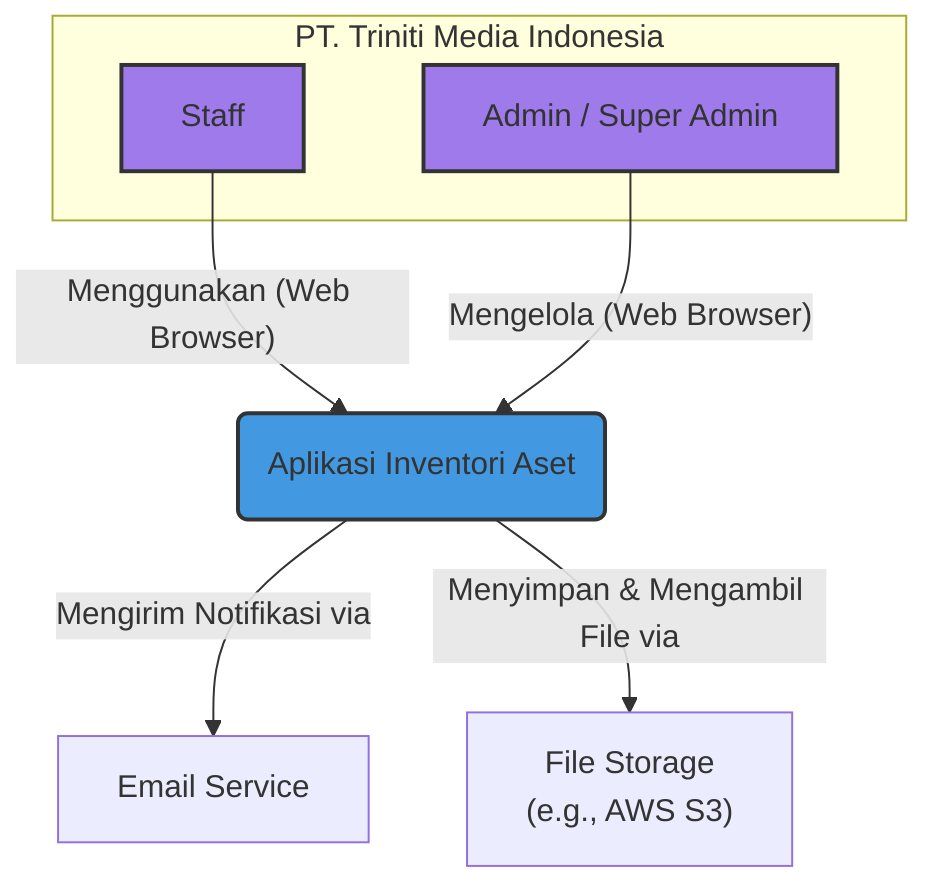
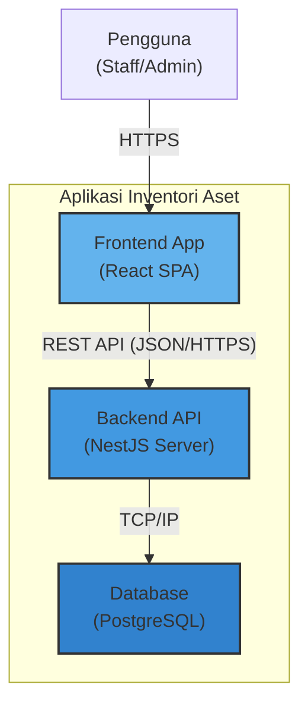
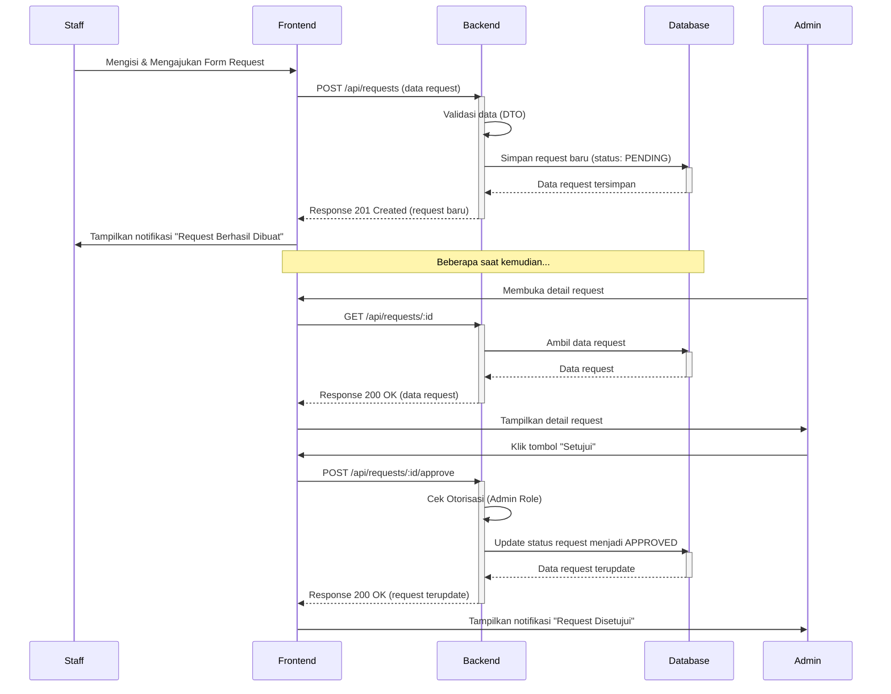

# Arsitektur Sistem & Konsep

Dokumen ini menjelaskan blueprint arsitektural tingkat tinggi dari Aplikasi Inventori Aset. Tujuannya adalah untuk memberikan pemahaman konseptual tentang bagaimana komponen-komponen utama sistem saling terhubung dan berinteraksi.

---

## 1. Visi Arsitektur

Aplikasi ini dirancang dengan arsitektur **Client-Server** yang modern dan terpisah (_decoupled_). Ini memungkinkan pengembangan, penskalaan, dan pemeliharaan yang independen antara antarmuka pengguna (Frontend) dan logika bisnis (Backend).

-   **Frontend (Client)**: Aplikasi React yang berjalan di browser pengguna. Bertanggung jawab penuh atas UI/UX, menampilkan data, dan menangkap input pengguna.
-   **Backend (Server)**: Aplikasi NestJS yang berjalan di server. Bertanggung jawab atas logika bisnis, validasi data, keamanan, dan interaksi dengan database.
-   **Database**: PostgreSQL sebagai penyimpan data persisten.
-   **Komunikasi**: Frontend dan Backend berkomunikasi melalui **REST API** yang aman menggunakan format JSON.

Untuk detail teknologi yang digunakan, silakan lihat dokumen [**Tumpukan Teknologi**](./TECHNOLOGY_STACK.md).

---

## 2. Diagram Arsitektur (C4 Model)

Diagram berikut menggunakan notasi C4 untuk memvisualisasikan arsitektur dalam berbagai tingkat detail.

### Level 1: Diagram Konteks Sistem

Diagram ini menunjukkan gambaran besar: bagaimana sistem aplikasi inventori berinteraksi dengan pengguna dan sistem lain.

### Level 2: Diagram Kontainer

Diagram ini memperbesar "Aplikasi Inventori Aset" untuk menunjukkan komponen-komponen utama di dalamnya.

---

## 3. Alur Data Utama: Proses Request Aset

Diagram berikut menggambarkan alur data dan interaksi antar komponen saat seorang staf membuat permintaan aset baru hingga disetujui.

---

## 4. Referensi Lanjutan

Untuk detail implementasi yang lebih spesifik, silakan merujuk ke dokumen berikut:

-   [**Panduan Pengembangan Frontend**](../../02_DEVELOPMENT_GUIDES/FRONTEND_GUIDE.md)
-   [**Panduan Pengembangan Backend**](../../02_DEVELOPMENT_GUIDES/BACKEND_GUIDE.md)