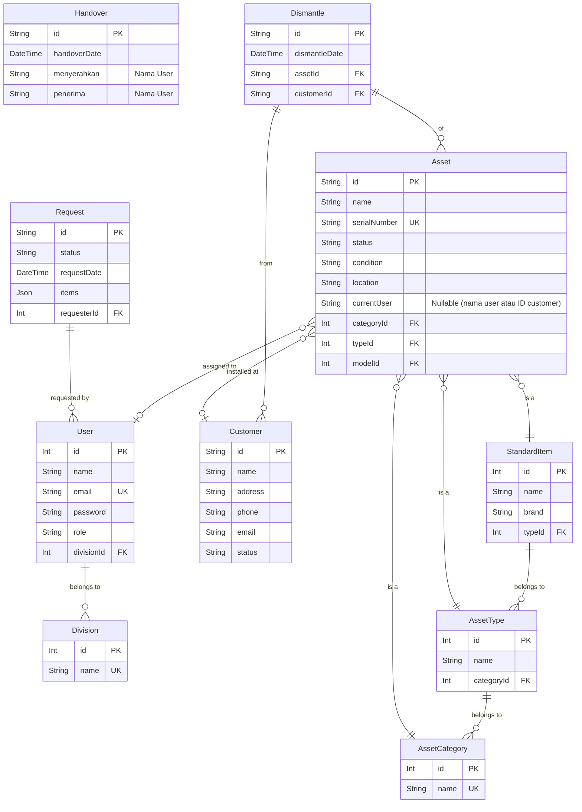

# Dokumentasi Skema Database

Dokumen ini menjelaskan struktur logis dan relasi antar tabel dalam database PostgreSQL untuk Aplikasi Inventori Aset.

## 1. Entity-Relationship Diagram (ERD)

Diagram berikut memvisualisasikan entitas utama dan hubungannya.

_Catatan: Diagram ini disederhanakan untuk menunjukkan relasi utama. Beberapa kolom dan tabel perantara (misal: untuk item handover) tidak ditampilkan._

## 2. Data Dictionary

Berikut adalah penjelasan untuk tabel-tabel utama dalam database.

### Tabel: `User`
Menyimpan informasi akun pengguna yang dapat login ke sistem.

| Nama Kolom   | Tipe Data         | Keterangan                                       |
|--------------|-------------------|--------------------------------------------------|
| `id`         | SERIAL `(PK)`     | ID unik untuk setiap pengguna.                   |
| `name`       | VARCHAR(255)      | Nama lengkap pengguna.                           |
| `email`      | VARCHAR(255) `(UK)`| Alamat email unik untuk login.                   |
| `password`   | VARCHAR(255)      | Hash kata sandi pengguna (menggunakan bcrypt).   |
| `role`       | VARCHAR(50)       | Peran pengguna: `Staff`, `Manager`, `Admin`, `Super Admin`. |
| `divisionId` | INTEGER `(FK)`    | ID divisi tempat pengguna bernaung. Relasi ke tabel `Division`. |

### Tabel: `Asset`
Tabel inti yang menyimpan data setiap unit aset yang dimiliki perusahaan.

| Nama Kolom       | Tipe Data         | Keterangan                                                                     |
|------------------|-------------------|--------------------------------------------------------------------------------|
| `id`             | VARCHAR(20) `(PK)`| ID unik aset, biasanya dengan format `AST-XXXX`.                               |
| `name`           | VARCHAR(255)      | Nama aset (misal: "Router WiFi Archer C6").                                    |
| `serialNumber`   | VARCHAR(100) `(UK)`| Nomor seri unik dari pabrikan.                                                 |
| `status`         | VARCHAR(50)       | Status aset saat ini: `IN_STORAGE`, `IN_USE`, `DAMAGED`, `DECOMMISSIONED`.     |
| `condition`      | VARCHAR(50)       | Kondisi fisik aset: `BRAND_NEW`, `GOOD`, `USED_OKAY`, `MINOR_DAMAGE`, dll.     |
| `location`       | VARCHAR(255)      | Lokasi fisik aset (misal: "Gudang Inventori", "Terpasang di Pelanggan X").      |
| `currentUser`    | VARCHAR(255)      | Nama staf atau ID pelanggan yang sedang menggunakan/bertanggung jawab atas aset. |
| `purchaseDate`   | DATE              | Tanggal pembelian aset.                                                        |
| `purchasePrice`  | DECIMAL(12, 2)    | Harga beli aset.                                                               |
| `warrantyEndDate`| DATE              | Tanggal berakhirnya masa garansi.                                              |
| `isDismantled`   | BOOLEAN           | Menandakan apakah aset pernah ditarik dari pelanggan.                          |

### Tabel: `Request`
Mencatat setiap permintaan pengadaan barang/aset dari pengguna.

| Nama Kolom      | Tipe Data           | Keterangan                                                                                |
|-----------------|---------------------|-------------------------------------------------------------------------------------------|
| `id`            | VARCHAR(20) `(PK)`  | ID unik permintaan, biasanya dengan format `REQ-XXX`.                                     |
| `status`        | VARCHAR(50)         | Status alur kerja permintaan: `PENDING`, `APPROVED`, `REJECTED`, `COMPLETED`, dll.        |
| `requestDate`   | TIMESTAMP           | Tanggal dan waktu permintaan dibuat.                                                      |
| `requesterId`   | INTEGER `(FK)`      | ID pengguna yang membuat permintaan. Relasi ke tabel `User`.                              |
| `finalApproverId`| INTEGER `(FK)`    | ID pengguna (Admin/Super Admin) yang memberikan persetujuan final.                        |
| `items`         | JSONB               | Array JSON yang berisi detail item yang diminta (nama, jumlah, keterangan).             |
| `order`         | JSONB               | Objek JSON yang berisi tipe order (`Regular`, `Urgent`, `Project Based`) dan detailnya.   |

### Tabel: `Customer`
Menyimpan data pelanggan PT. Triniti Media Indonesia.

| Nama Kolom | Tipe Data        | Keterangan                                       |
|------------|------------------|--------------------------------------------------|
| `id`       | VARCHAR(20) `(PK)`| ID unik pelanggan, biasanya `TMI-XXXXX`.         |
| `name`     | VARCHAR(255)     | Nama lengkap pelanggan atau nama perusahaan.     |
| `address`  | TEXT             | Alamat lengkap pelanggan.                        |
| `phone`    | VARCHAR(20)      | Nomor telepon pelanggan.                         |
| `status`   | VARCHAR(50)      | Status pelanggan: `Aktif`, `Tidak Aktif`, `Suspend`. |

### Tabel: `Handover` & `Dismantle`
Mencatat transaksi perpindahan aset.
-   **`Handover`**: Mencatat serah terima internal antar karyawan.
-   **`Dismantle`**: Mencatat penarikan aset dari lokasi pelanggan.
Kedua tabel ini memiliki struktur serupa untuk mencatat tanggal, pihak yang terlibat, dan aset yang ditransaksikan, yang kemudian menjadi bagian dari riwayat/log aktivitas sebuah aset.
