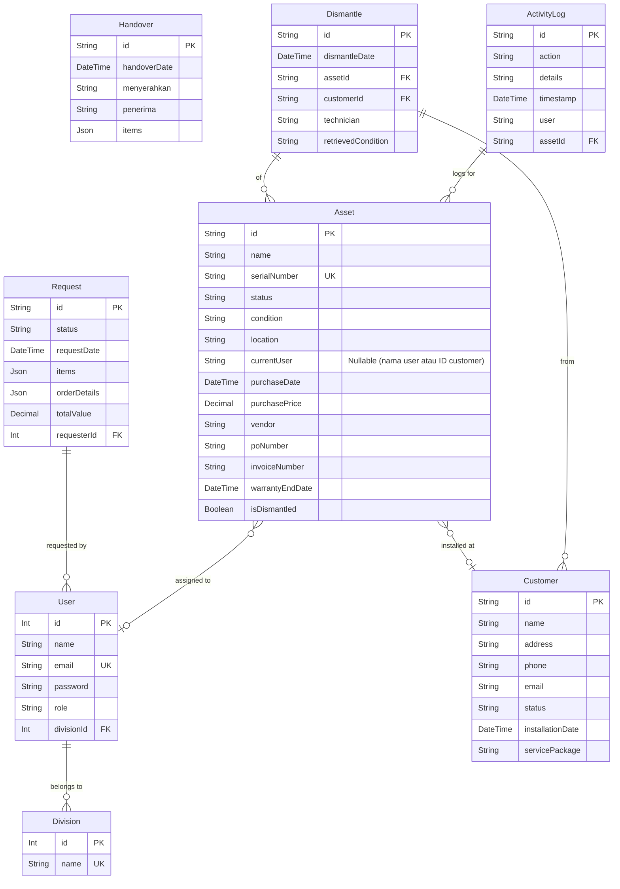

# Dokumentasi Skema Database

Dokumen ini menjelaskan struktur logis dan relasi antar tabel dalam database PostgreSQL untuk Aplikasi Inventori Aset. Skema ini dirancang berdasarkan definisi tipe di `src/types/index.ts` dan berfungsi sebagai cetak biru untuk implementasi menggunakan Prisma ORM.

## 1. Entity-Relationship Diagram (ERD)

Diagram berikut memvisualisasikan entitas utama dan hubungannya.

_Catatan: Diagram ini disederhanakan untuk menunjukkan relasi utama. Beberapa kolom tidak ditampilkan untuk kejelasan._

## 2. Data Dictionary

Berikut adalah penjelasan untuk tabel-tabel utama dalam database.

### Tabel: `User`
Menyimpan informasi akun pengguna yang dapat login ke sistem.

| Nama Kolom   | Tipe Data         | Keterangan                                       |
|--------------|-------------------|--------------------------------------------------|
| `id`         | SERIAL `(PK)`     | ID unik untuk setiap pengguna.                   |
| `name`       | VARCHAR(255)      | Nama lengkap pengguna.                           |
| `email`      | VARCHAR(255) `(UK)`| Alamat email unik untuk login.                   |
| `password`   | VARCHAR(255)      | Hash kata sandi pengguna (menggunakan bcrypt).   |
| `role`       | VARCHAR(50)       | Peran pengguna: `Staff`, `Manager`, `Admin`, `Super Admin`. |
| `divisionId` | INTEGER `(FK)`    | ID divisi tempat pengguna bernaung. Relasi ke tabel `Division`. |

### Tabel: `Asset`
Tabel inti yang menyimpan data setiap unit aset yang dimiliki perusahaan.

| Nama Kolom       | Tipe Data         | Keterangan                                                                     |
|------------------|-------------------|--------------------------------------------------------------------------------|
| `id`             | VARCHAR(20) `(PK)`| ID unik aset, biasanya dengan format `AST-XXXX`.                               |
| `name`           | VARCHAR(255)      | Nama aset (misal: "Router WiFi Archer C6").                                    |
| `category`       | VARCHAR(255)      | Kategori aset (misal: "Perangkat Pelanggan (CPE)").                             |
| `type`           | VARCHAR(255)      | Tipe aset dalam kategori (misal: "Router WiFi").                                |
| `brand`          | VARCHAR(100)      | Merek aset.                                                                    |
| `serialNumber`   | VARCHAR(100) `(UK)`| Nomor seri unik dari pabrikan.                                                 |
| `macAddress`     | VARCHAR(17)       | MAC Address, jika ada.                                                         |
| `registrationDate`| DATE             | Tanggal aset dicatat di sistem.                                                |
| `recordedBy`     | VARCHAR(255)      | Nama pengguna yang mencatat aset.                                              |
| `purchaseDate`   | DATE              | Tanggal pembelian aset.                                                        |
| `purchasePrice`  | DECIMAL(12, 2)    | Harga beli aset.                                                               |
| `vendor`         | VARCHAR(255)      | Nama vendor atau toko tempat pembelian.                                        |
| `poNumber`       | VARCHAR(50)       | Nomor Purchase Order terkait.                                                  |
| `invoiceNumber`  | VARCHAR(100)      | Nomor faktur pembelian.                                                        |
| `warrantyEndDate`| DATE              | Tanggal berakhirnya masa garansi.                                              |
| `location`       | VARCHAR(255)      | Lokasi fisik aset (misal: "Gudang Inventori", "Terpasang di Pelanggan X").      |
| `locationDetail` | VARCHAR(255)      | Detail lokasi (misal: "Rak C-05").                                             |
| `currentUser`    | VARCHAR(255)      | Nama staf atau ID pelanggan yang sedang menggunakan/bertanggung jawab atas aset. |
| `status`         | VARCHAR(50)       | Status aset: `IN_STORAGE`, `IN_USE`, `DAMAGED`, `UNDER_REPAIR`, `DECOMMISSIONED`. |
| `condition`      | VARCHAR(50)       | Kondisi fisik aset: `BRAND_NEW`, `GOOD`, `USED_OKAY`, `MINOR_DAMAGE`, dll.     |
| `notes`          | TEXT              | Catatan tambahan.                                                              |
| `isDismantled`   | BOOLEAN           | Menandakan apakah aset pernah ditarik dari pelanggan.                          |

### Tabel: `Request`
Mencatat setiap permintaan pengadaan barang/aset dari pengguna.

| Nama Kolom      | Tipe Data           | Keterangan                                                                                |
|-----------------|---------------------|-------------------------------------------------------------------------------------------|
| `id`            | VARCHAR(20) `(PK)`  | ID unik permintaan, biasanya dengan format `REQ-XXX`.                                     |
| `status`        | VARCHAR(50)         | Status alur kerja: `PENDING`, `APPROVED`, `REJECTED`, `COMPLETED`, dll.        |
| `requestDate`   | TIMESTAMP           | Tanggal dan waktu permintaan dibuat.                                                      |
| `requesterId`   | INTEGER `(FK)`      | ID pengguna yang membuat permintaan. Relasi ke tabel `User`.                              |
| `finalApproverId`| INTEGER `(FK)`    | ID pengguna (Admin/Super Admin) yang memberikan persetujuan final.                        |
| `items`         | JSONB               | Array JSON yang berisi detail item yang diminta (nama, jumlah, keterangan).             |
| `order`         | JSONB               | Objek JSON yang berisi tipe order (`Regular`, `Urgent`, `Project Based`) dan detailnya.   |
| `totalValue`    | DECIMAL(12, 2)      | Estimasi total nilai permintaan.                                                          |
| `rejectionReason`| TEXT             | Alasan jika permintaan ditolak.                                                           |

### Tabel: `Customer`
Menyimpan data pelanggan PT. Triniti Media Indonesia.

| Nama Kolom | Tipe Data        | Keterangan                                       |
|------------|------------------|--------------------------------------------------|
| `id`       | VARCHAR(20) `(PK)`| ID unik pelanggan, biasanya `TMI-XXXXX`.         |
| `name`     | VARCHAR(255)     | Nama lengkap pelanggan atau nama perusahaan.     |
| `address`  | TEXT             | Alamat lengkap pelanggan.                        |
| `phone`    | VARCHAR(20)      | Nomor telepon pelanggan.                         |
| `email`    | VARCHAR(255)     | Alamat email pelanggan.                          |
| `status`   | VARCHAR(50)      | Status pelanggan: `Aktif`, `Tidak Aktif`, `Suspend`. |
| `installationDate`| DATE     | Tanggal instalasi layanan pertama kali.          |
| `servicePackage`| VARCHAR(100)| Nama paket layanan yang digunakan.               |

### Tabel: `ActivityLog`
Mencatat semua histori penting yang terjadi pada sebuah aset.

| Nama Kolom    | Tipe Data         | Keterangan                                         |
|---------------|-------------------|----------------------------------------------------|
| `id`          | SERIAL `(PK)`     | ID unik untuk setiap entri log.                    |
| `assetId`     | VARCHAR(20) `(FK)`| ID aset yang terkait. Relasi ke tabel `Asset`.     |
| `timestamp`   | TIMESTAMP         | Waktu kejadian.                                    |
| `user`        | VARCHAR(255)      | Nama pengguna yang melakukan aksi.                 |
| `action`      | VARCHAR(100)      | Jenis aksi (misal: 'Aset Dicatat', 'Serah Terima').|
| `details`     | TEXT              | Deskripsi detail dari aksi yang dilakukan.         |
| `referenceId` | VARCHAR(50)       | ID dokumen terkait (misal: ID Handover, Request).  |