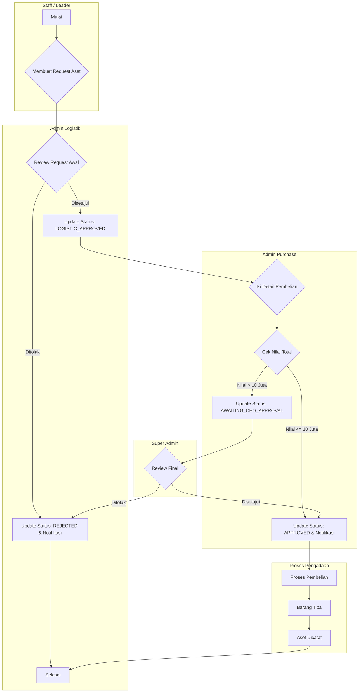
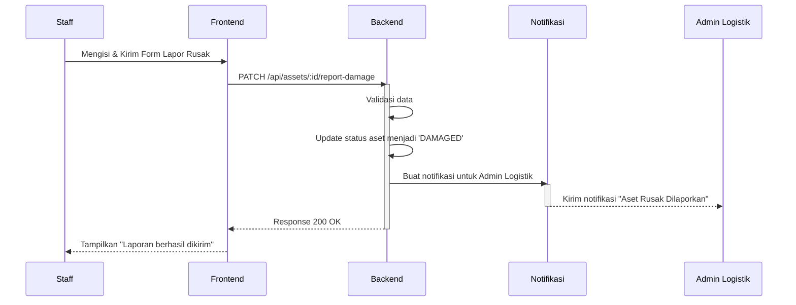
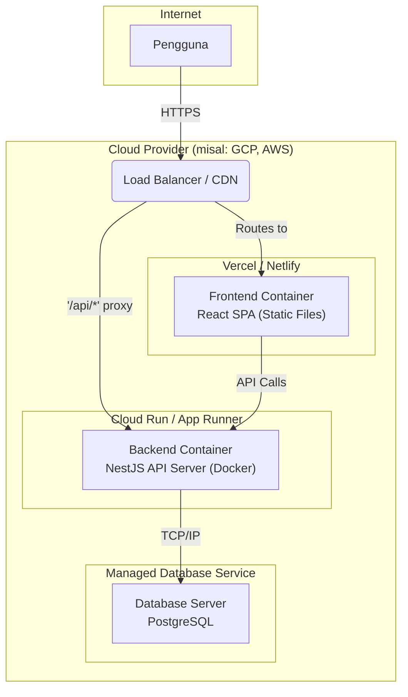

# Panduan Diagram Sistem

Dokumen ini berfungsi sebagai referensi pusat untuk semua jenis diagram yang digunakan selama siklus hidup pengembangan (Software Development Life Cycle - SDLC) Aplikasi Inventori Aset. Setiap diagram memiliki tujuan spesifik, menargetkan audiens tertentu, dan berfungsi sebagai bahasa visual bersama untuk memastikan semua pemangku kepentingan memiliki pemahaman yang sama.

## Ringkasan Diagram Berdasarkan Fase Pengembangan

Tabel berikut memetakan setiap fase pengembangan ke diagram yang relevan, menjelaskan tujuan utamanya, dan mengidentifikasi pengguna utama dari diagram tersebut.

| Fase Pengembangan                | Nama Diagram         | Tujuan Utama                                                              | Pengguna Utama                                                         |
| -------------------------------- | -------------------- | ------------------------------------------------------------------------- | ---------------------------------------------------------------------- |
| **Analisis Kebutuhan**           | **Use Case Diagram** | Mendefinisikan fungsionalitas sistem dari sudut pandang pengguna.           | Analis Bisnis, Manajer Produk, Klien                                   |
|                                  | **BPMN Diagram**     | Memodelkan alur kerja bisnis (*business process*) secara detail.          | Analis Bisnis, Ahli Proses                                             |
| **Perancangan Sistem (Struktural)** | **ERD**              | Merancang skema dan struktur logis database.                              | Arsitek Database, Pengembang Backend                                   |
|                                  | **Class Diagram**    | Merancang struktur kode, atribut, metode, dan hubungan antar objek.       | Arsitek Perangkat Lunak, Pengembang                                    |
| **Perancangan Sistem (Perilaku)**  | **Sequence Diagram** | Menggambarkan interaksi dan urutan pesan antar komponen/objek.            | Pengembang, Arsitek Perangkat Lunak                                    |
|                                  | **Activity Diagram** | Memodelkan alur logika yang kompleks atau algoritma (seperti *flowchart*). | Pengembang, Analis Bisnis                                              |
| **Perancangan UI & Infra**       | **Wireframe/Mockup** | Merancang tata letak visual dan alur interaksi antarmuka pengguna (UI).   | Desainer UI/UX, Pengembang Frontend, Manajer Produk                    |
|                                  | **Deployment Diagram**| Merancang arsitektur fisik (server, jaringan) dan penempatan komponen.    | Tim Infrastruktur (DevOps), Arsitek Sistem                             |

---

## Contoh Implementasi Diagram

Bagian ini menyediakan contoh visual konkret untuk diagram-diagram utama yang disebutkan di atas.

### Contoh 1: Use Case Diagram - Interaksi Pengguna Utama
Diagram ini menunjukkan fungsionalitas utama yang dapat diakses oleh setiap peran pengguna (aktor) dalam sistem.

```mermaid
usecaseDiagram
  left to right direction
  actor "Staff / Leader" as Staff
  actor "Admin Logistik" as AdminL
  actor "Admin Purchase" as AdminP
  actor "Super Admin" as SuperAdmin

  AdminL --|> Staff
  AdminP --|> Staff
  SuperAdmin --|> AdminL
  SuperAdmin --|> AdminP

  rectangle "Aplikasi Inventori Aset" {
    Staff -- (Membuat Request Aset)
    Staff -- (Melihat Aset Pribadi)
    Staff -- (Melaporkan Kerusakan)

    AdminL -- (Mencatat Aset Baru)
    AdminL -- (Mengelola Handover/Dismantle)
    AdminL -- (Mengelola Perbaikan Aset)

    AdminP -- (Menyetujui Request)
    AdminP -- (Mengisi Detail Pembelian)

    SuperAdmin -- (Mengelola Pengguna & Divisi)
    SuperAdmin -- (Memberi Persetujuan Final)
  }
```

### Contoh 2: BPMN Diagram - Alur Kerja Permintaan Aset
Diagram ini (disimulasikan menggunakan Flowchart dengan *swimlane*) memodelkan alur kerja bisnis yang krusial dari awal permintaan aset hingga selesai.



### Contoh 3: Sequence Diagram - Alur Laporan Kerusakan Aset
Diagram ini menggambarkan urutan pesan dan interaksi antar komponen sistem ketika seorang pengguna melaporkan kerusakan aset.



### Contoh 4: Deployment Diagram - Arsitektur Produksi
Diagram ini memberikan gambaran arsitektur fisik tentang bagaimana komponen aplikasi akan di-deploy di lingkungan produksi cloud.



---

## Integrasi dengan Dokumentasi Proyek

Diagram-diagram ini bukanlah artefak yang berdiri sendiri, melainkan konsep yang diwujudkan dalam berbagai dokumen di dalam proyek ini:

-   **Use Case & BPMN Diagram**: Konsep dari diagram-diagram ini diwujudkan dalam bentuk naratif di dalam [**Product Requirements Document (PRD)**](./PRODUCT_REQUIREMENTS.md) melalui *User Stories* dan *Business Rules*.

-   **ERD (Entity-Relationship Diagram)**: Implementasi konkret dari ERD dapat ditemukan dalam [**Dokumen Skema Database**](./DATABASE_SCHEMA.md), yang mencakup model data dan relasi dalam format `schema.prisma`.

-   **Class, Sequence, & Activity Diagram**: Prinsip-prinsip dari diagram-diagram ini dijelaskan dan diimplementasikan dalam [**Dokumen Arsitektur Sistem**](./ARCHITECTURE.md) dan [**Panduan Pengembangan Backend**](./../02_DEVELOPMENT_GUIDES/BACKEND_GUIDE.md), yang merinci bagaimana *Controllers*, *Services*, dan komponen lain berinteraksi.

-   **Wireframe/Mockup**: Konsep visual ini diwujudkan dalam [**Design System**](./../03_STANDARDS_AND_PROCEDURES/DESIGN_SYSTEM.md) dan direalisasikan dalam **prototipe fungsional** yang sedang berjalan.

-   **Deployment Diagram**: Rencana implementasi dari diagram ini dijelaskan secara rinci dalam [**Panduan Deployment**](./../04_OPERATIONS/DEPLOYMENT.md).