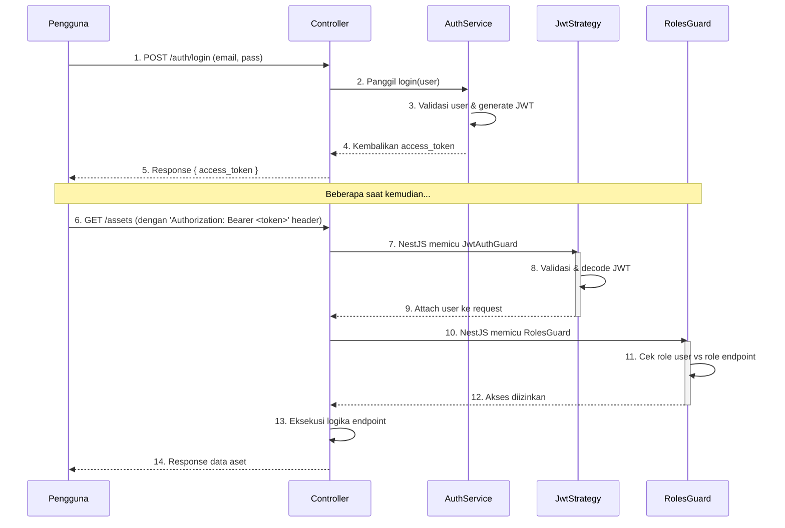

# Panduan Pengembangan Backend

Dokumen ini memberikan panduan teknis mendalam mengenai arsitektur, pola, dan praktik terbaik untuk pengembangan sisi server (backend) aplikasi Inventori Aset.

## 1. Tumpukan Teknologi

Backend dibangun di atas tumpukan teknologi modern berbasis TypeScript untuk memastikan _type-safety_, skalabilitas, dan kemudahan pemeliharaan.

-   **Framework**: **NestJS** ([https://nestjs.com/](https://nestjs.com/))
-   **Database**: **PostgreSQL**
-   **ORM (Object-Relational Mapping)**: **Prisma** ([https://www.prisma.io/](https://www.prisma.io/))
-   **Autentikasi**: **JWT (JSON Web Tokens)** dengan **Passport.js**

## 2. Struktur Proyek (`backend/src`)

NestJS mendorong arsitektur modular. Setiap domain bisnis (fitur) dikemas dalam modulnya sendiri. Berikut adalah struktur detailnya:

```
src/
│
├── main.ts             # Titik masuk aplikasi: inisialisasi server, pipe validasi global, filter error, dll.
├── app.module.ts       # Modul root yang mengimpor semua modul fitur dan konfigurasi global.
│
├── auth/               # Modul untuk autentikasi (login, register) dan manajemen profil.
│   ├── auth.module.ts
│   ├── auth.controller.ts
│   ├── auth.service.ts
│   ├── guards/
│   │   ├── jwt-auth.guard.ts
│   │   └── roles.guard.ts
│   ├── strategies/
│   │   └── jwt.strategy.ts   # Memvalidasi JWT dari header Authorization.
│   └── decorators/
│       └── roles.decorator.ts    # Menetapkan role yang diizinkan untuk sebuah endpoint.
│
├── assets/             # Contoh modul fitur untuk manajemen Aset.
│   ├── assets.module.ts
│   ├── assets.controller.ts
│   ├── assets.service.ts
│   └── dto/
│       ├── create-asset.dto.ts # DTO untuk validasi data saat membuat aset baru.
│       └── update-asset.dto.ts # DTO untuk validasi data saat memperbarui aset.
│
└── shared/             # Modul/layanan bersama yang digunakan di banyak modul fitur.
    └── prisma/
        ├── prisma.module.ts
        └── prisma.service.ts # Service yang menyediakan akses ke Prisma Client.
```

## 3. Alur Autentikasi & Otorisasi

Diagram berikut menggambarkan alur bagaimana seorang pengguna login dan mengakses endpoint yang terproteksi.



**Langkah-langkah:**
1.  **Login**: Pengguna mengirim kredensial. `AuthService` memvalidasinya dan mengembalikan sebuah JWT.
2.  **Akses Terproteksi**: Klien mengirimkan JWT di setiap header `Authorization` untuk request berikutnya.
3.  **Verifikasi Token**: `JwtAuthGuard` (melalui `JwtStrategy`) secara otomatis memverifikasi token. Jika valid, data pengguna dari payload token akan ditambahkan ke objek `request`.
4.  **Otorisasi Peran**: `RolesGuard` (jika digunakan) memeriksa apakah peran pengguna (`request.user.role`) diizinkan untuk mengakses endpoint tersebut.
5.  Jika semua pemeriksaan berhasil, logika di _controller_ akan dieksekusi.

## 4. Database & Prisma

-   **Single Source of Truth**: File `prisma/schema.prisma` adalah satu-satunya tempat di mana model data, relasi, dan tipe data didefinisikan.
-   **Migrasi**: Setiap perubahan pada `schema.prisma` harus diikuti dengan pembuatan file migrasi baru.
    ```bash
    # Membuat file migrasi baru dan menerapkannya ke database development
    pnpm prisma migrate dev --name <nama-migrasi-deskriptif>
    ```
-   **Prisma Client**: Klien database yang di-generate secara otomatis dan sepenuhnya _type-safe_. Digunakan di dalam _services_ untuk semua operasi database (CRUD).

## 5. Panduan Menambah Fitur Baru (Contoh: Modul "Suppliers")

1.  **Gunakan NestJS CLI**: Buat kerangka modul, controller, dan service secara otomatis.
    ```bash
    nest g resource suppliers --no-spec
    ```
2.  **Update Skema Prisma**: Buka `prisma/schema.prisma` dan tambahkan model `Supplier`.
3.  **Jalankan Migrasi**: `pnpm prisma migrate dev --name add-suppliers-table`
4.  **Implementasikan Service (`suppliers.service.ts`)**: Tulis logika bisnis untuk CRUD suppliers menggunakan `PrismaService`.
5.  **Implementasikan Controller (`suppliers.controller.ts`)**: Buat endpoint REST API (`@Get`, `@Post`, dll.) dan panggil metode dari `SuppliersService`. Gunakan DTOs untuk validasi.
6.  **Lindungi Endpoint**: Tambahkan `@UseGuards(JwtAuthGuard)` dan, jika perlu, `@Roles(...)` pada endpoint yang memerlukan autentikasi/otorisasi.
7.  **Daftarkan Modul**: Impor `SuppliersModule` ke dalam `app.module.ts`.

## 6. Pilar Profesional Backend

-   **Validasi**: Gunakan `class-validator` dan `class-transformer` dalam DTOs dan aktifkan `ValidationPipe` secara global di `main.ts`.
-   **Penanganan Error**: Gunakan filter `HttpExceptionFilter` global untuk menangkap semua `HttpException` dan format _response_ error secara konsisten.
-   **Logging**: Gunakan `Logger` bawaan NestJS.
-   **Dokumentasi API**: Manfaatkan `@nestjs/swagger` untuk mendokumentasikan DTOs dan _endpoints_.
-   **Keamanan**: Gunakan `Helmet` untuk mengamankan header HTTP dan aktifkan `CORS` dengan konfigurasi yang ketat di `main.ts`.