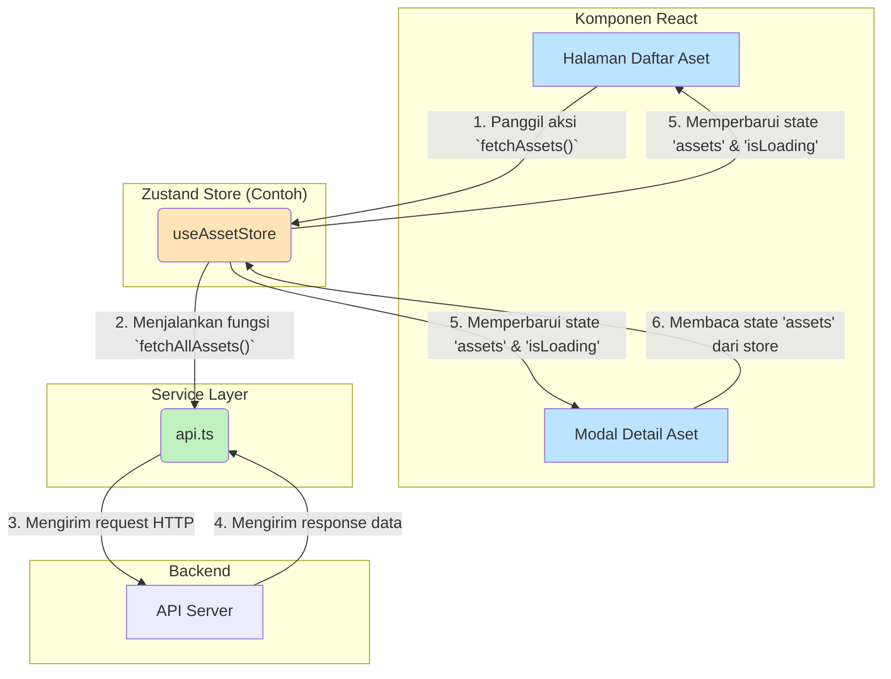

# Panduan Pengembangan Frontend

Dokumen ini menjelaskan arsitektur, pola, dan konvensi yang digunakan dalam pengembangan frontend aplikasi Inventori Aset.

## 1. Prinsip Utama

-   **Modular & Dapat Digunakan Kembali (Reusable)**: Kode diorganisir ke dalam komponen-komponen kecil dan independen yang mudah untuk digunakan kembali dan diuji.
-   **Pemisahan Tanggung Jawab (Separation of Concerns)**: Logika bisnis, logika tampilan (UI), dan manajemen state dipisahkan untuk meningkatkan keterbacaan dan pemeliharaan.
-   **Kinerja**: Aplikasi dirancang agar tetap cepat dan responsif, terutama saat menangani data dalam jumlah besar, dengan menerapkan teknik seperti paginasi dan virtualisasi.
-   **Pengalaman Pengguna (UX)**: Antarmuka harus intuitif, konsisten, dan memberikan umpan balik yang jelas kepada pengguna (misalnya, state loading, pesan error, notifikasi).

## 2. Tumpukan Teknologi

-   **Framework**: **React 18**
-   **Bahasa**: **TypeScript**
-   **Styling**: **Tailwind CSS**
-   **Manajemen State**: **React Hooks** (`useState`, `useContext`) untuk state lokal dan sederhana. **Zustand** (direkomendasikan) untuk state global yang lebih kompleks.
-   **Pustaka Ikon**: **React Icons**
-   **Build Tool**: **Vite**

## 3. Struktur Folder (`src`)

Struktur folder dirancang berdasarkan **fitur** untuk menjaga agar kode yang saling terkait tetap berdekatan. Hierarki detailnya adalah sebagai berikut:

```
src/
│
├── App.tsx             # Komponen root, menangani routing, layout utama, dan state global.
├── index.tsx           # Titik masuk aplikasi React.
│
├── components/         # Komponen UI "bodoh" (dumb) yang dapat digunakan kembali di seluruh aplikasi.
│   ├── icons/          # Kumpulan komponen ikon (misal: AssetIcon.tsx, CloseIcon.tsx).
│   ├── layout/         # Komponen untuk struktur halaman (misal: Sidebar.tsx, FormPageLayout.tsx).
│   └── ui/             # Komponen UI dasar & interaktif (misal: Button.tsx, Modal.tsx, CustomSelect.tsx).
│
├── features/           # Folder utama untuk setiap fitur/halaman bisnis. Setiap folder adalah modul mandiri.
│   ├── assetRegistration/
│   │   ├── RegistrationPage.tsx      # Komponen Halaman Utama (mengelola state & logika).
│   │   └── components/
│   │       └── RegistrationForm.tsx  # Komponen Form Pencatatan Aset.
│   │
│   ├── auth/
│   │   ├── LoginPage.tsx
│   │   └── components/
│   │       └── DemoAccounts.tsx
│   │
│   ├── dashboard/
│   │   ├── DashboardPage.tsx
│   │   └── components/
│   │       ├── StatCard.tsx
│   │       └── ActivityItem.tsx
│   │
│   ├── itemRequest/
│   │   ├── ItemRequestPage.tsx
│   │   └── components/
│   │       ├── RequestForm.tsx
│   │       ├── RequestTable.tsx
│   │       └── RequestStatusIndicator.tsx
│   │
│   ├── preview/
│   │   └── PreviewModal.tsx            # Modal pratinjau detail yang dapat digunakan lintas fitur.
│   │
│   └── ... (dan folder fitur lainnya seperti `handover`, `dismantle`, `customers`, dll.)
│
├── hooks/              # Custom React Hooks yang dapat digunakan kembali.
│   ├── useSortableData.ts
│   ├── useLongPress.ts
│   └── ...
│
├── providers/          # Penyedia konteks (React Context) untuk fungsionalitas global.
│   └── NotificationProvider.tsx # Mengelola sistem notifikasi (toast) di seluruh aplikasi.
│
├── services/           # Modul untuk berkomunikasi dengan API backend.
│   └── api.ts          # Berisi semua fungsi `fetch` untuk mengambil atau mengirim data ke server.
│
├── types/              # Definisi tipe dan interface TypeScript global.
│   └── index.ts        # File tunggal untuk semua tipe data (Asset, Request, User, dll).
│
└── utils/              # Fungsi utilitas murni (pure functions) yang tidak terkait dengan React.
    ├── csvExporter.ts  # Fungsi untuk mengekspor data ke format CSV.
    └── scanner.ts      # Logika untuk mem-parsing data dari pemindai QR/Barcode.
```

## 4. Alur Data & Manajemen State

State global (seperti daftar aset, request, pengguna) dikelola menggunakan Zustand untuk menghindari _prop-drilling_ dan menyederhanakan logika.



1.  **Komponen** (`A`) memanggil sebuah aksi dari _store_ (misal: `useAssetStore.getState().fetchAssets()`).
2.  **Aksi di Store** (`C`) memanggil fungsi yang sesuai dari _service layer_ (`D`).
3.  **Service Layer** (`D`) menangani komunikasi dengan API Server (`E`).
4.  Setelah mendapatkan data, _service layer_ mengembalikannya ke _store_.
5.  **Store** (`C`) memperbarui _state_-nya.
6.  Semua komponen (`A`, `B`) yang "mendengarkan" _store_ tersebut akan **otomatis me-render ulang** dengan data yang baru.

## 5. Filosofi Komponen

-   **Komponen UI (`src/components/ui`)**:
    -   Komponen ini bersifat **presentasional** (bodoh/dumb).
    -   Mereka tidak tahu tentang logika bisnis atau dari mana data berasal.
    -   Mereka menerima data dan fungsi callback melalui `props`.
    -   Contoh: `Button.tsx`, `Modal.tsx`, `CustomSelect.tsx`.

-   **Komponen Fitur (`src/features/...`)**:
    -   Komponen ini bersifat **pintar** (smart) atau _container_.
    -   Mereka bertanggung jawab atas logika bisnis, mengambil data dari API, dan mengelola state untuk sebuah fitur.
    -   Mereka menggunakan komponen UI untuk membangun antarmuka.
    -   Contoh: `ItemRequestPage.tsx` mengambil data request dan menampilkannya menggunakan tabel dan modal.

## 6. Styling dengan Tailwind CSS

-   **Utility-First**: Gunakan kelas utilitas Tailwind secara langsung di dalam JSX. Ini mempercepat pengembangan dan menjaga konsistensi.
-   **Konfigurasi Tema**: Warna kustom (`tm-primary`, `tm-accent`), font, dan ekstensi lainnya didefinisikan di `index.html` dalam tag `<script>`. Ini memastikan branding yang konsisten di seluruh aplikasi.
-   **Kelas Kustom**: Untuk properti yang lebih kompleks atau berulang (seperti scrollbar kustom atau animasi), kelas CSS global didefinisikan di `index.html` dalam tag `<style>`.

## 7. Interaksi dengan API

-   **Layer Layanan (`src/services/api.ts`)**: Semua logika untuk berkomunikasi dengan backend API terpusat di file ini. Ini membuat kode lebih terorganisir dan memudahkan jika ada perubahan pada URL API atau header.
-   **Penanganan Asinkron**: Gunakan `async/await` dengan blok `try...catch` untuk menangani panggilan API.
-   **State Loading dan Error**: Setiap komponen fitur yang mengambil data harus memiliki state untuk `isLoading` dan `error`. Tampilkan indikator loading (spinner) saat data diambil dan pesan error yang jelas jika terjadi kegagalan.

## 8. Strategi Testing

Lihat [**Panduan Testing**](./TESTING_GUIDE.md) untuk detail lengkap mengenai strategi pengujian.
