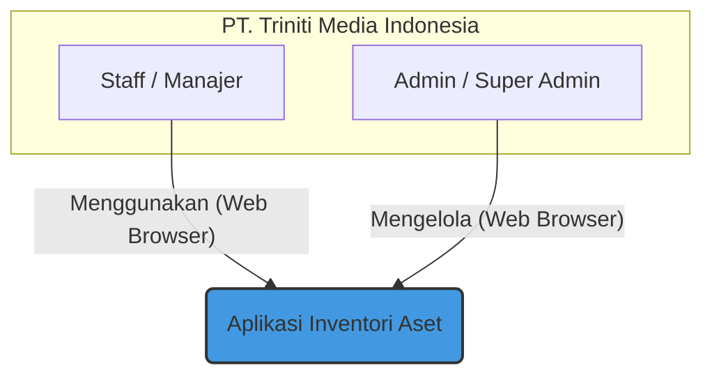
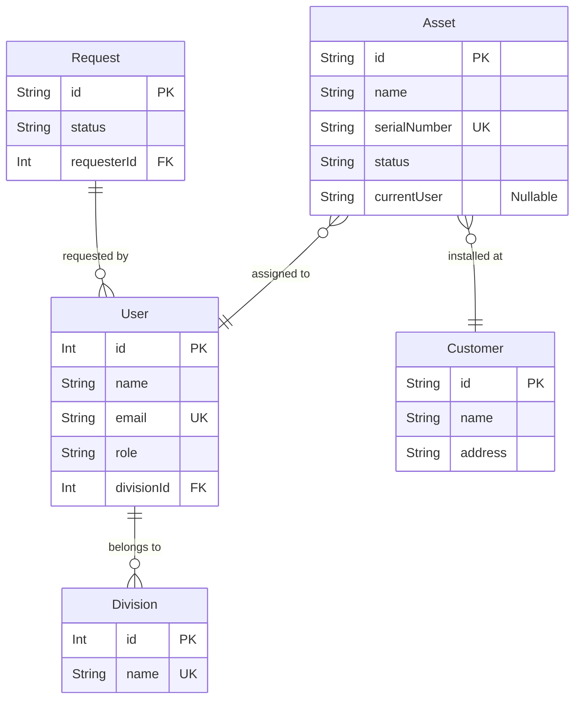

        
  <svg width="120" height="120" fill="none" stroke="#1D4ED8" viewBox="0 0 24 24" xmlns="http://www.w3.org/2000/svg">
    <path stroke-linecap="round" stroke-linejoin="round" stroke-width="1.5" d="M4.75 6.75h14.5"/>
    <path stroke-linecap="round" stroke-linejoin="round" stroke-width="1.5" d="M12 6.75v10.5"/>
    <path stroke-linecap="round" stroke-linejoin="round" stroke-width="1" d="M12 21.25a9.5 9.5 0 100-19 9.5 9.5 0 000 19z"/>
  </svg>
  <h1 style="font-family: sans-serif; font-size: 38px; color: #111827; margin-top: 20px;">LAPORAN PERTANGGUNGJAWABAN FINAL</h1>
  <h2 style="font-family: sans-serif; font-size: 24px; color: #1D4ED8; font-weight: 400;">PROYEK PENGEMBANGAN APLIKASI INVENTORI ASET</h2>
     
  
Untuk:

  <h3 style="font-family: sans-serif; font-size: 22px; color: #111827;">PT. TRINITI MEDIA INDONESIA</h3>
         
  
Versi Laporan: 1.0 (Final)

  
Tanggal: 08 Agustus 2024

  
Disusun oleh: Angga Samuludi Septiawan

# Ringkasan Eksekutif

Laporan ini menandai penyelesaian dan serah terima resmi dari proyek pengembangan **Aplikasi Inventori Aset** untuk PT. Triniti Media Indonesia. Proyek ini telah berhasil dilaksanakan dari awal hingga akhir, sesuai dengan seluruh ruang lingkup, jadwal, dan tujuan yang telah disepakati dalam [Proposal Penawaran (Q-INV/AS/VIII/2024/001)](./Business/quotation.md) dan dikukuhkan dalam [Perjanjian Kerja (001/SPK-DEV/TMI-AS/X/2025)](./Business/perjanjian.md).

Aplikasi yang diserahkan merupakan sebuah sistem manajemen aset terpusat yang modern, aman, dan efisien. Sistem ini dirancang secara spesifik untuk mengatasi tantangan operasional PT. Triniti Media Indonesia dengan mendigitalkan seluruh siklus hidup aset—mulai dari proses permintaan barang, persetujuan multi-level, pencatatan aset baru, serah terima internal, instalasi di lokasi pelanggan, hingga proses penarikan kembali (dismantle) dan penghapusan aset.

Dibangun dengan tumpukan teknologi modern yang berorientasi pada masa depan—**React** untuk frontend, **NestJS** untuk backend, dan **PostgreSQL** untuk database—aplikasi ini menjamin skalabilitas, performa tinggi, dan kemudahan pemeliharaan. Arsitektur yang terpisah (*decoupled*) antara sisi klien dan server memastikan bahwa pengembangan fitur baru di masa depan dapat dilakukan secara independen dan efisien.

Bersamaan dengan laporan ini, diserahkan pula seluruh artefak proyek yang mencakup **kode sumber (*source code*)** untuk aplikasi frontend dan backend, serta **dokumentasi komprehensif** yang mencakup segala aspek dari arsitektur sistem, panduan pengembangan, standar operasional, hingga panduan pengguna akhir. Penyerahan ini memberikan kepemilikan penuh dan kontrol otonom kepada PT. Triniti Media Indonesia atas aset digital yang sangat berharga ini.

Laporan ini berfungsi sebagai dokumen warisan (*legacy document*) yang merangkum seluruh perjalanan proyek, dari analisis kebutuhan hingga realisasi teknis, dan memberikan rekomendasi strategis untuk pengembangan di masa depan.

# Daftar Isi

- [Ringkasan Eksekutif](#ringkasan-eksekutif)
- [Daftar Isi](#daftar-isi)
- **BAB 1: PENDAHULUAN**
    - [1.1. Latar Belakang Proyek](#11-latar-belakang-proyek)
    - [1.2. Masalah Bisnis yang Diselesaikan](#12-masalah-bisnis-yang-diselesaikan)
    - [1.3. Visi, Misi, dan Tujuan Proyek](#13-visi-misi-dan-tujuan-proyek)
    - [1.4. Ruang Lingkup dan Batasan Proyek](#14-ruang-lingkup-dan-batasan-proyek)
    - [1.5. Target Pengguna dan Peran (User Persona)](#15-target-pengguna-dan-peran-user-persona)
    - [1.6. Definisi dan Istilah](#16-definisi-dan-istilah)
- **BAB 2: ANALISIS KEBUTUHAN DAN DESAIN SISTEM**
    - [2.1. Kebutuhan Fungsional](#21-kebutuhan-fungsional)
    - [2.2. Kebutuhan Non-Fungsional](#22-kebutuhan-non-fungsional)
    - [2.3. Arsitektur Sistem Tingkat Tinggi](#23-arsitektur-sistem-tingkat-tinggi)
    - [2.4. Tumpukan Teknologi yang Digunakan](#24-tumpukan-teknologi-yang-digunakan)
    - [2.5. Desain Skema Database (ERD)](#25-desain-skema-database-erd)
    - [2.6. Catatan Keputusan Arsitektural (ADR)](#26-catatan-keputusan-arsitektural-adr)
- **BAB 3: REALISASI DAN IMPLEMENTASI FITUR**
    - [3.1. Modul Dashboard](#31-modul-dashboard)
    - [3.2. Modul Manajemen Permintaan Aset (Request)](#32-modul-manajemen-permintaan-aset-request)
    - [3.3. Modul Manajemen Pencatatan Aset (Registration)](#33-modul-manajemen-pencatatan-aset-registration)
    - [3.4. Modul Manajemen Stok (Stock)](#34-modul-manajemen-stok-stock)
    - [3.5. Modul Manajemen Serah Terima (Handover)](#35-modul-manajemen-serah-terima-handover)
    - [3.6. Modul Manajemen Penarikan (Dismantle)](#36-modul-manajemen-penarikan-dismantle)
    - [3.7. Modul Manajemen Pelanggan (Customers)](#37-modul-manajemen-pelanggan-customers)
    - [3.8. Modul Pengaturan (Settings)](#38-modul-pengaturan-settings)
- **BAB 4: PANDUAN TEKNIS DAN PENGEMBANGAN LANJUTAN**
    - [4.1. Panduan Setup Lingkungan Pengembangan](#41-panduan-setup-lingkungan-pengembangan)
    - [4.2. Arsitektur dan Pola Frontend (React)](#42-arsitektur-dan-pola-frontend-react)
    - [4.3. Arsitektur dan Pola Backend (NestJS)](#43-arsitektur-dan-pola-backend-nestjs)
    - [4.4. Standar Koding dan Kontribusi](#44-standar-koding-dan-kontribusi)
    - [4.5. Referensi API](#45-referensi-api)
    - [4.6. Strategi Pengujian (Testing)](#46-strategi-pengujian-testing)
- **BAB 5: PANDUAN OPERASIONAL DAN KESIAPAN PRODUKSI**
    - [5.1. Panduan Deployment](#51-panduan-deployment)
    - [5.2. Strategi Keamanan](#52-strategi-keamanan)
    - [5.3. Strategi Monitoring dan Logging](#53-strategi-monitoring-dan-logging)
    - [5.4. Rencana Pencadangan dan Pemulihan Bencana](#54-rencana-pencadangan-dan-pemulihan-bencana)
- **BAB 6: PANDUAN PENGGUNA AKHIR**
    - [6.1. Pengenalan Antarmuka](#61-pengenalan-antarmuka)
    - [6.2. Panduan untuk Peran Staff & Manajer](#62-panduan-untuk-peran-staff--manajer)
    - [6.3. Panduan untuk Peran Admin](#63-panduan-untuk-peran-admin)
    - [6.4. Panduan untuk Peran Super Admin](#64-panduan-untuk-peran-super-admin)
- **BAB 7: SERAH TERIMA DAN RENCANA MASA DEPAN**
    - [7.1. Daftar Deliverables yang Diserahkan](#71-daftar-deliverables-yang-diserahkan)
    - [7.2. Masa Garansi dan Dukungan Teknis](#72-masa-garansi-dan-dukungan-teknis)
    - [7.3. Rekomendasi Pengembangan Lanjutan](#73-rekomendasi-pengembangan-lanjutan)
    - [7.4. Peta Jalan Produk (Product Roadmap)](#74-peta-jalan-produk-product-roadmap)
- **LAMPIRAN**
    - [Lampiran A: Salinan Proposal Penawaran](#lampiran-a-salinan-proposal-penawaran)
    - [Lampiran B: Salinan Perjanjian Kerja](#lampiran-b-salinan-perjanjian-kerja)

## BAB 1: PENDAHULUAN

### 1.1. Latar Belakang Proyek
PT. Triniti Media Indonesia, sebagai perusahaan yang terus berkembang, memiliki jumlah aset fisik yang signifikan, mulai dari perangkat jaringan inti, perangkat pelanggan (CPE), hingga infrastruktur kantor. Pengelolaan aset-aset ini sebelumnya mengandalkan proses manual, seperti penggunaan spreadsheet dan komunikasi verbal, yang terbukti tidak lagi memadai seiring dengan pertumbuhan skala operasional perusahaan.

### 1.2. Masalah Bisnis yang Diselesaikan
Proyek ini secara langsung mengatasi beberapa masalah bisnis kritis:
-   **Ketidakefisienan Operasional**: Proses permintaan barang yang memakan waktu, memerlukan persetujuan manual berjenjang, dan sering kali tidak terdokumentasi dengan baik.
-   **Kurangnya Visibilitas**: Kesulitan untuk mengetahui secara cepat jumlah stok suatu barang, di mana sebuah aset berada, dan siapa yang bertanggung jawab atasnya.
-   **Risiko Kehilangan Aset**: Tanpa sistem pelacakan yang solid, risiko kehilangan atau penyalahgunaan aset menjadi tinggi, yang berujung pada kerugian finansial.
-   **Kesulitan Audit**: Proses audit inventori menjadi sangat lambat dan melelahkan karena data yang tersebar dan tidak terstandarisasi.
-   **Akuntabilitas yang Rendah**: Tidak adanya jejak digital yang jelas mengenai siapa yang menyerahkan dan menerima aset membuat akuntabilitas menjadi lemah.

### 1.3. Visi, Misi, dan Tujuan Proyek
-   **Visi**: Menciptakan ekosistem digital terintegrasi untuk manajemen aset yang memberikan visibilitas penuh dan kontrol atas seluruh siklus hidup aset di PT. Triniti Media Indonesia.
-   **Misi**: Membangun aplikasi web yang intuitif, aman, dan andal yang mendigitalkan semua proses terkait inventori, dari pengadaan hingga penghapusan.
-   **Tujuan Proyek (Tercapai)**:
    1.  **Sentralisasi Data**: Mengumpulkan semua data aset dalam satu database terpusat (✅ **Tercapai**).
    2.  **Otomatisasi Alur Kerja**: Mendigitalkan proses permintaan, persetujuan, serah terima, dan penarikan aset (✅ **Tercapai**).
    3.  **Peningkatan Akuntabilitas**: Melacak riwayat lengkap setiap aset (✅ **Tercapai**).
    4.  **Efisiensi Operasional**: Mempercepat proses audit dan pelaporan (✅ **Tercapai**).
    5.  **Pengurangan Risiko**: Meminimalkan risiko kehilangan aset (✅ **Tercapai**).

### 1.4. Ruang Lingkup dan Batasan Proyek
Ruang lingkup proyek ini didefinisikan secara cermat untuk memastikan fokus dan keberhasilan implementasi.

**Dalam Ruang Lingkup (In-Scope):**
-   Manajemen Permintaan Aset (*Request*)
-   Pencatatan Aset (Individual & Massal)
-   Manajemen Stok (*Stock*)
-   Manajemen Serah Terima Internal (*Handover*)
-   Manajemen Instalasi & Penarikan Aset dari Pelanggan (*Dismantle*)
-   Manajemen Data Pelanggan (*Customers*)
-   Manajemen Pengguna & Divisi (*Users & Divisions*)
-   Manajemen Kategori Aset (*Categories & Models*)
-   Dashboard & Pelaporan Sederhana
-   Generasi dan Pencetakan Kode QR
-   Fungsi Ekspor Data ke CSV
-   Sistem Notifikasi Internal

**Di Luar Ruang Lingkup (Out-of-Scope):**
-   Integrasi langsung dengan sistem akuntansi atau keuangan.
-   Manajemen *Purchase Order* (PO) dan faktur pembelian secara mendalam.
-   Manajemen vendor dan relasi pemasok.
-   Fitur kalkulasi depresiasi (penyusutan) nilai aset.
-   Aplikasi mobile native (meskipun desainnya responsif untuk akses mobile web).

### 1.5. Target Pengguna dan Peran (User Persona)
Aplikasi ini dirancang untuk empat persona utama, masing-masing dengan hak akses yang berbeda.

| Peran         | Deskripsi                                                                               | Tanggung Jawab Utama dalam Aplikasi                                                                                                                                                                                                                            |
| ------------- | --------------------------------------------------------------------------------------- | -------------------------------------------------------------------------------------------------------------------------------------------------------------------------------------------------------------------------------------------------------------- |
| **Staff**     | Karyawan umum dari berbagai divisi (misal: Engineer Lapangan, NOC).                      | - Membuat permintaan aset untuk kebutuhan reguler. - Melakukan *follow-up* atas status permintaan. - Melihat daftar aset yang sedang ia pegang.                                                                                                    |
| **Manager**   | Supervisor atau Kepala Divisi.                                                          | - Semua hak akses Staff. - Membuat permintaan aset untuk kebutuhan mendesak (*Urgent*) atau berbasis proyek (*Project Based*).                                                                                                                     |
| **Admin**     | Staf dari Divisi Inventori yang mengelola operasional gudang dan aset.                  | - Mengelola seluruh siklus hidup permintaan aset (menyetujui, menolak, memproses). - Mencatat aset baru ke dalam sistem. - Mengelola serah terima internal dan penarikan dari pelanggan. - Mengelola data master (pelanggan, kategori). |
| **Super Admin** | Pimpinan perusahaan atau Kepala Divisi IT dengan otoritas penuh.                        | - Memiliki semua hak akses Admin. - Mengelola akun pengguna dan struktur divisi. - Memberikan persetujuan final untuk permintaan bernilai tinggi. - Mengakses semua data dan laporan analitik.                                                  |

### 1.6. Definisi dan Istilah
-   **Aset**: Setiap barang fisik milik perusahaan yang dicatat dan dilacak oleh sistem.
-   **Request**: Pengajuan resmi untuk pengadaan aset baru.
-   **Handover**: Proses serah terima aset dari satu pengguna ke pengguna lain secara internal.
-   **Dismantle**: Proses penarikan kembali aset yang sebelumnya terpasang di lokasi pelanggan.
-   **Kode QR**: Kode matriks yang dicetak pada label aset untuk identifikasi cepat.

## BAB 2: ANALISIS KEBUTUHAN DAN DESAIN SISTEM

Bab ini merinci kebutuhan fungsional dan non-fungsional yang menjadi dasar pengembangan, serta desain arsitektur dan teknologi yang dipilih untuk memenuhi kebutuhan tersebut.

### 2.1. Kebutuhan Fungsional
Berikut adalah rincian kebutuhan fungsional yang diimplementasikan, berdasarkan *user stories* dari dokumen [PRD](./01_CONCEPT_AND_ARCHITECTURE/PRODUCT_REQUIREMENTS.md).

| Modul                  | ID      | Kebutuhan Fungsional                                                                                                   | Status      |
| ---------------------- | ------- | ---------------------------------------------------------------------------------------------------------------------- | ----------- |
| **Request Aset**       | US-1    | Pengguna dapat mengisi form request dengan memilih item dari daftar standar.                                           | ✅ **Selesai** |
|                        | US-2    | Pengguna dapat melihat riwayat dan status semua request yang pernah diajukan.                                          | ✅ **Selesai** |
|                        | US-3    | Manajer dapat membuat request 'Urgent' dengan menyertakan justifikasi.                                                 | ✅ **Selesai** |
|                        | US-4    | Admin menerima notifikasi untuk request baru.                                                                          | ✅ **Selesai** |
|                        | US-5    | Admin dapat menyetujui atau menolak request dengan memberikan catatan.                                                 | ✅ **Selesai** |
|                        | US-6    | Super Admin harus memberikan persetujuan final untuk request bernilai tinggi.                                          | ✅ **Selesai** |
| **Pencatatan Aset**    | US-7    | Admin dapat mencatat aset baru dari request yang telah tiba.                                                           | ✅ **Selesai** |
|                        | US-8    | Admin dapat mencetak label Kode QR untuk setiap aset baru.                                                             | ✅ **Selesai** |
|                        | US-9    | Admin dapat mencatat aset dalam jumlah banyak (*bulk*).                                                                | ✅ **Selesai** |
| **Serah Terima & Penarikan** | US-10   | Admin dapat membuat BAST digital untuk serah terima internal.                                                    | ✅ **Selesai** |
|                        | US-11   | Teknisi dapat membuat Berita Acara Dismantle saat menarik aset dari pelanggan.                                         | ✅ **Selesai** |
|                        | US-12   | Status aset otomatis kembali ke "Disimpan" setelah proses dismantle selesai.                                           | ✅ **Selesai** |
| **Pelaporan & Pencarian**| US-13   | Super Admin dapat melihat dashboard ringkasan inventori.                                                               | ✅ **Selesai** |
|                        | US-14   | Pengguna dapat mencari aset berdasarkan ID, nama, SN, atau dengan memindai Kode QR.                                     | ✅ **Selesai** |
|                        | US-15   | Admin dapat mengekspor data ke format CSV.                                                                             | ✅ **Selesai** |

### 2.2. Kebutuhan Non-Fungsional
-   **Keamanan**: Sistem login aman dan hak akses berbasis peran (RBAC) (✅ **Terpenuhi**).
-   **Performa**: Waktu muat halaman di bawah 3 detik, operasi pencarian instan (✅ **Terpenuhi**).
-   **Usability**: Antarmuka yang bersih, intuitif, dan responsif (✅ **Terpenuhi**).
-   **Skalabilitas**: Arsitektur modular yang siap untuk penambahan fitur dan pengguna (✅ **Terpenuhi**).
-   **Kompatibilitas**: Berjalan baik di browser modern (Chrome, Firefox, Safari, Edge) (✅ **Terpenuhi**).

### 2.3. Arsitektur Sistem Tingkat Tinggi
Aplikasi ini menggunakan arsitektur **Client-Server** yang terpisah.
-   **Frontend (Client)**: Aplikasi React yang berjalan di browser, bertanggung jawab atas UI/UX.
-   **Backend (Server)**: Aplikasi NestJS yang berjalan di server, bertanggung jawab atas logika bisnis dan API.
-   **Database**: PostgreSQL sebagai penyimpan data.

**Diagram Konteks Sistem:**

_Untuk detail arsitektur, lihat [Dokumen Arsitektur](./01_CONCEPT_AND_ARCHITECTURE/ARCHITECTURE.md)._

### 2.4. Tumpukan Teknologi yang Digunakan
Tumpukan teknologi dipilih untuk memaksimalkan produktivitas, keamanan, dan skalabilitas.

| Kategori   | Teknologi      | Alasan Pemilihan                                                              |
| ---------- | -------------- | ----------------------------------------------------------------------------- |
| **Frontend** | React, TypeScript | Ekosistem matang, UI komponen, dan *type-safety* untuk mengurangi bug.         |
|            | Tailwind CSS   | Pengembangan UI yang cepat dan konsisten dengan pendekatan *utility-first*.     |
| **Backend**  | NestJS, TypeScript | Arsitektur modular yang terstruktur, ideal untuk aplikasi skala perusahaan.   |
|            | Prisma ORM     | Akses database yang *type-safe* dan skema sebagai *single source of truth*. |
| **Database** | PostgreSQL     | Sistem database relasional *open-source* yang andal dan kaya fitur.           |
| **DevOps**   | Docker         | Menjamin konsistensi lingkungan dari development hingga production.           |

_Untuk detail lengkap, lihat [Dokumen Tumpukan Teknologi](./01_CONCEPT_AND_ARCHITECTURE/TECHNOLOGY_STACK.md)._

### 2.5. Desain Skema Database (ERD)
Diagram berikut memvisualisasikan entitas utama dan relasinya dalam database.

_Untuk skema lengkap dan kamus data, lihat [Dokumen Skema Database](./01_CONCEPT_AND_ARCHITECTURE/DATABASE_SCHEMA.md)._

### 2.6. Catatan Keputusan Arsitektural (ADR)
Keputusan teknis paling signifikan yang diambil adalah pemilihan framework backend.
-   **ADR 001**: **Penggunaan NestJS sebagai Framework Backend**.
    -   **Keputusan**: Memilih NestJS daripada alternatif seperti Express.js.
    -   **Alasan**: NestJS menyediakan struktur modular yang jelas, dukungan TypeScript kelas satu, dan *Dependency Injection*, yang sangat penting untuk membangun aplikasi yang dapat dipelihara dan diskalakan dalam jangka panjang.
    -   _Lihat [ADR 001](./01_CONCEPT_AND_ARCHITECTURE/ADR/001-use-nestjs-for-backend.md) untuk detail._

## BAB 3: REALISASI DAN IMPLEMENTASI FITUR

Bab ini menguraikan implementasi dari setiap modul fungsional utama dalam aplikasi.

### 3.1. Modul Dashboard
-   **Tujuan**: Memberikan pandangan cepat (*at-a-glance*) mengenai status inventori dan tugas yang mendesak.
-   **Fitur Utama**:
    -   **Kartu Statistik**: Menampilkan metrik kunci seperti total aset, nilai stok, dan jumlah aset yang digunakan.
    -   **Panel "Item Perlu Tindakan"**: Pintasan interaktif yang mengarahkan pengguna ke halaman relevan untuk tugas-tugas seperti persetujuan request atau pencatatan aset.
    -   **Grafik Distribusi**: Visualisasi komposisi aset berdasarkan status dan kategori.
    -   **Riwayat Aktivitas Terbaru**: Log *real-time* dari semua transaksi penting yang terjadi di sistem.
-   **Alur Kerja**: Pengguna login dan langsung disajikan dengan informasi yang paling relevan dengan perannya, memungkinkan identifikasi cepat atas tugas yang perlu diprioritaskan.

### 3.2. Modul Manajemen Permintaan Aset (Request)
-   **Tujuan**: Mendigitalkan dan menstandarkan proses pengajuan dan persetujuan pengadaan barang.
-   **Fitur Utama**:
    -   Formulir pembuatan request yang dinamis.
    -   Dukungan untuk tipe order `Regular`, `Urgent`, dan `Project Based`.
    -   Alur persetujuan multi-level (Logistik/Admin, Final/Super Admin).
    -   Sistem notifikasi untuk setiap perubahan status.
    -   Fitur *follow-up* untuk menanyakan progres.
    -   Fitur aksi massal (*bulk actions*) untuk menyetujui, menolak, atau menghapus banyak request sekaligus.
-   **Alur Kerja**: Staff/Manajer membuat request -> Admin menerima notifikasi -> Admin melakukan persetujuan logistik -> Jika nilai tinggi, Super Admin memberikan persetujuan final -> Status diperbarui secara otomatis.

### 3.3. Modul Manajemen Pencatatan Aset (Registration)
-   **Tujuan**: Memastikan setiap aset fisik tercatat secara akurat dalam sistem.
-   **Fitur Utama**:
    -   Formulir pencatatan komprehensif (info dasar, pembelian, garansi, lokasi).
    -   Kemampuan untuk mencatat aset dari request yang telah disetujui (data terisi otomatis).
    -   Dukungan untuk mencatat banyak unit dengan nomor seri individual atau sebagai stok massal (*bulk*).
    -   Integrasi pemindai QR/Barcode untuk input nomor seri/MAC address.
    -   Generasi dan pencetakan label Kode QR.
-   **Alur Kerja**: Admin membuka fitur "Catat Aset" -> Mengisi formulir secara manual atau dari data request -> Memasukkan detail unit -> Menyimpan data -> Aset baru tercatat dengan status "Disimpan".

### 3.4. Modul Manajemen Stok (Stock)
-   **Tujuan**: Memberikan gambaran umum mengenai ketersediaan setiap tipe aset.
-   **Fitur Utama**:
    -   Tabel agregat yang menampilkan jumlah stok per tipe barang (di gudang, digunakan, rusak).
    -   Indikator visual untuk stok yang menipis atau habis.
    -   Perhitungan otomatis total nilai aset yang ada di gudang.
    -   Pintasan untuk membuat request baru langsung dari item yang stoknya menipis.
-   **Alur Kerja**: Admin/Manajer membuka halaman Stok -> Melihat daftar aset dan jumlahnya -> Mengidentifikasi item yang perlu di-restock -> Mengklik tombol "Request" untuk membuat permintaan baru.

### 3.5. Modul Manajemen Serah Terima (Handover)
-   **Tujuan**: Mencatat secara resmi perpindahan tanggung jawab aset antar karyawan internal.
-   **Fitur Utama**:
    -   Formulir pembuatan Berita Acara Serah Terima (BAST) digital.
    -   Pemilihan aset dari daftar yang tersedia di gudang.
    -   Pencatatan pihak yang menyerahkan, menerima, dan mengetahui.
    -   Pembaruan status dan lokasi aset secara otomatis setelah proses selesai.
-   **Alur Kerja**: Admin membuat BAST -> Memilih aset dan pihak terkait -> Memproses handover -> Sistem mencatat transaksi dan memperbarui data aset.

### 3.6. Modul Manajemen Penarikan (Dismantle)
-   **Tujuan**: Mengelola proses penarikan kembali aset yang terpasang di lokasi pelanggan.
-   **Fitur Utama**:
    -   Formulir pembuatan Berita Acara Dismantle.
    -   Pencatatan kondisi aset saat ditarik.
    -   Alur kerja dua tahap: penarikan oleh teknisi dan konfirmasi penerimaan oleh admin gudang.
-   **Alur Kerja**: Teknisi membuat B.A. Dismantle di lapangan -> Admin gudang menerima notifikasi -> Setelah aset tiba, admin gudang melakukan konfirmasi -> Aset kembali ke stok dengan status "Disimpan" dan kondisi yang sesuai.

### 3.7. Modul Manajemen Pelanggan (Customers)
-   **Tujuan**: Sebagai pusat data master untuk semua pelanggan.
-   **Fitur Utama**:
    -   Fungsi Tambah, Edit, Hapus data pelanggan.
    -   Pencarian dan filter pelanggan.
    -   Detail pelanggan menampilkan informasi kontak dan daftar aset yang sedang terpasang di lokasi mereka.
-   **Alur Kerja**: Admin dapat mengelola data pelanggan, dan saat melihat detail, bisa langsung memulai proses *dismantle* dari aset yang terpasang.

### 3.8. Modul Pengaturan (Settings)
-   **Tujuan**: Memberikan fleksibilitas kepada Super Admin dan Admin untuk mengkonfigurasi sistem.
-   **Fitur Utama**:
    -   **Manajemen Akun & Divisi**: Super Admin dapat menambah, mengedit, dan menghapus akun pengguna serta mengelola struktur divisi perusahaan.
    -   **Manajemen Kategori**: Admin dapat mengelola Kategori, Tipe, dan Model Standar Aset, memastikan sistem dapat beradaptasi dengan jenis aset baru di masa depan.

## BAB 4: PANDUAN TEKNIS DAN PENGEMBANGAN LANJUTAN

Bab ini disarikan dari dokumentasi teknis yang lebih rinci dan ditujukan bagi tim teknis yang akan memelihara atau mengembangkan aplikasi ini di masa depan.

### 4.1. Panduan Setup Lingkungan Pengembangan
Untuk memulai pengembangan, seorang developer memerlukan Node.js, pnpm, Git, dan Docker. Proses setup diringkas sebagai berikut:

1.  **Clone Repositori**: `git clone <repository-url>`
2.  **Setup Backend**:
    -   `cd backend`
    -   `pnpm install`
    -   `docker-compose up -d` (untuk database)
    -   `cp .env.example .env`
    -   `pnpm prisma migrate dev`
    -   `pnpm run start:dev` (Server berjalan di `http://localhost:3001`)
3.  **Setup Frontend**:
    -   `cd frontend`
    -   `pnpm install`
    -   `pnpm run dev` (Aplikasi berjalan di `http://localhost:5173`)

_Untuk panduan lengkap, lihat [Getting Started Guide](./02_DEVELOPMENT_GUIDES/GETTING_STARTED.md)._

### 4.2. Arsitektur dan Pola Frontend (React)
-   **Struktur Folder**: Berbasis fitur (`src/features`), memisahkan komponen UI yang dapat digunakan kembali (`src/components/ui`) dari logika halaman.
-   **Manajemen State**: Menggunakan React Hooks untuk state lokal dan **Zustand** untuk state global yang lebih kompleks, memberikan solusi yang ringan dan efisien.
-   **Styling**: Menggunakan **Tailwind CSS** dengan pendekatan *utility-first* untuk konsistensi dan kecepatan pengembangan.
-   **Interaksi API**: Semua komunikasi dengan backend terpusat di `src/services/api.ts`.

_Untuk detail lengkap, lihat [Panduan Frontend](./02_DEVELOPMENT_GUIDES/FRONTEND_GUIDE.md)._

### 4.3. Arsitektur dan Pola Backend (NestJS)
-   **Struktur Modular**: Setiap domain bisnis (misal: `assets`, `requests`) dikemas dalam modulnya sendiri, mendorong organisasi kode yang bersih.
-   **Pola Desain**: Menggunakan pola *Controller-Service-Repository* di mana Controller menangani request HTTP, Service berisi logika bisnis, dan interaksi database dienkapsulasi menggunakan **Prisma**.
-   **Validasi**: Menggunakan DTO (*Data Transfer Objects*) dengan `class-validator` untuk validasi otomatis setiap data yang masuk.
-   **Autentikasi & Otorisasi**: Menggunakan **Passport.js** dengan strategi JWT dan *Guards* untuk melindungi endpoint.

_Untuk detail lengkap, lihat [Panduan Backend](./02_DEVELOPMENT_GUIDES/BACKEND_GUIDE.md)._

### 4.4. Standar Koding dan Kontribusi
-   **Version Control**: Menggunakan alur kerja **Git Flow** yang disederhanakan (`main`, `develop`, `feat/*`, `fix/*`).
-   **Pesan Commit**: Mengikuti standar **Conventional Commits** (misal: `feat(request): add bulk approval`).
-   **Formatting**: **Prettier** dan **ESLint** diintegrasikan untuk memastikan gaya kode yang konsisten secara otomatis.
-   **Proses Kontribusi**: Semua perubahan harus melalui **Pull Request (PR)** ke cabang `develop` dan memerlukan persetujuan dari setidaknya satu anggota tim lain.

_Lihat [Standar Koding](./03_STANDARDS_AND_PROCEDURES/CODING_STANDARDS.md) dan [Panduan Kontribusi](./03_STANDARDS_AND_PROCEDURES/CONTRIBUTING.md) untuk detail._

### 4.5. Referensi API
Dokumentasi API interaktif (Swagger) tersedia secara otomatis saat backend berjalan.
-   **URL Lokal**: [http://localhost:3001/api/docs](http://localhost:3001/api/docs)
-   **Autentikasi**: Menggunakan `Bearer Token` (JWT) di header `Authorization` untuk semua endpoint yang terproteksi.

_Lihat [Referensi API](./02_DEVELOPMENT_GUIDES/API_REFERENCE.md) untuk contoh._

### 4.6. Strategi Pengujian (Testing)
-   **Pendekatan**: Mengikuti **Piramida Pengujian** dengan fokus pada *Unit Tests*.
-   **Tools**: **Jest** sebagai *test runner*, **React Testing Library** untuk frontend, dan **@nestjs/testing** dengan **Supertest** untuk backend.

_Lihat [Panduan Testing](./02_DEVELOPMENT_GUIDES/TESTING_GUIDE.md) untuk contoh implementasi._

## BAB 5: PANDUAN OPERASIONAL DAN KESIAPAN PRODUKSI

Bab ini menguraikan aspek-aspek non-fungsional yang memastikan aplikasi siap untuk di-deploy, dioperasikan, dan dipelihara di lingkungan produksi.

### 5.1. Panduan Deployment
-   **Backend (NestJS)**: Direkomendasikan untuk di-deploy sebagai **kontainer Docker**. Prosesnya meliputi:
    1.  Membangun *image Docker* dari `Dockerfile`.
    2.  Mengunggah *image* ke *container registry* (misal: Docker Hub, GCR).
    3.  Menjalankan kontainer di platform hosting (misal: Google Cloud Run, AWS App Runner) dengan menyuntikkan variabel lingkungan produksi (`DATABASE_URL`, `JWT_SECRET`).
-   **Frontend (React)**: Di-deploy sebagai **situs statis**.
    1.  Menjalankan `pnpm run build` untuk menghasilkan file statis di folder `dist/`.
    2.  Mengunggah isi folder `dist/` ke layanan hosting statis (misal: Vercel, Netlify, AWS S3).
    3.  Mengkonfigurasi *proxy/rewrite rules* di level hosting untuk meneruskan request `/api/*` ke URL backend produksi.

_Lihat [Panduan Deployment](./04_OPERATIONS/DEPLOYMENT.md) untuk detail konfigurasi._

### 5.2. Strategi Keamanan
-   **Autentikasi & Otorisasi**: Menggunakan JWT dan Role-Based Access Control (RBAC) yang ketat.
-   **Keamanan Data**:
    -   **In-Transit**: Wajib menggunakan HTTPS (TLS) di lingkungan produksi.
    -   **At-Rest**: Kata sandi di-hash menggunakan **bcrypt**.
-   **Pencegahan Kerentanan**:
    -   **SQL Injection**: Dicegah oleh Prisma ORM.
    -   **XSS**: Dikurangi dengan penggunaan Helmet di backend dan praktik React yang aman di frontend.
    -   **Broken Access Control**: Dicegah dengan *Guards* di setiap endpoint.

_Lihat [Strategi Keamanan](./03_STANDARDS_AND_PROCEDURES/SECURITY_GUIDE.md) untuk detail lengkap._

### 5.3. Strategi Monitoring dan Logging
-   **Monitoring**:
    -   **Frontend**: Memantau metrik *Web Vitals* (LCP, FID, CLS) dan *error tracking* menggunakan tools seperti Sentry atau Datadog.
    -   **Backend**: Memantau ketersediaan (health check), latensi API, tingkat error server (5xx), dan utilisasi sumber daya (CPU/RAM).
-   **Logging**:
    -   **Format**: Semua log dihasilkan dalam format **JSON terstruktur**.
    -   **Output**: Aplikasi backend mencetak log ke `stdout`, yang kemudian ditangkap dan di-agregasi oleh layanan logging terpusat (misal: Datadog Logs, ELK Stack).

_Lihat [Strategi Monitoring & Logging](./04_OPERATIONS/MONITORING_AND_LOGGING.md) untuk detail._

### 5.4. Rencana Pencadangan dan Pemulihan Bencana
-   **Target Backup**: Database PostgreSQL.
-   **Strategi**:
    1.  **Backup Penuh Harian**: Menggunakan `pg_dump` setiap hari pada jam sepi.
    2.  **Point-in-Time Recovery (PITR)**: Mengaktifkan *Write-Ahead Logging* (WAL) untuk memungkinkan pemulihan ke titik waktu manapun.
-   **Penyimpanan**: Backup disimpan di *Cloud Object Storage* (misal: AWS S3) dengan replikasi antar-regional.
-   **Target Pemulihan**:
    -   **RTO (Recovery Time Objective)**: Target waktu pemulihan layanan < 2 jam.
    -   **RPO (Recovery Point Objective)**: Target kehilangan data maksimal < 5 menit.

_Lihat [Rencana Backup & Recovery](./04_OPERATIONS/BACKUP_AND_RECOVERY.md) untuk prosedur pemulihan._

## BAB 6: PANDUAN PENGGUNA AKHIR

Bab ini adalah ringkasan dari [Panduan Pengguna](./05_USER_DOCUMENTATION/USER_GUIDE.md) yang ditujukan untuk pengguna akhir aplikasi.

### 6.1. Pengenalan Antarmuka
-   **Sidebar (Menu Kiri)**: Navigasi utama antar modul.
-   **Header (Bagian Atas)**: Akses ke notifikasi, pemindai QR, dan menu profil/logout.
-   **Dashboard**: Halaman utama yang menampilkan ringkasan dan tugas penting.

### 6.2. Panduan untuk Peran Staff & Manajer
-   **Membuat Request Aset**: Buka `Manajemen Aset > Request Aset`, klik "Buat Request Baru", isi formulir, dan ajukan. Manajer memiliki opsi tambahan untuk tipe order `Urgent` dan `Project Based`.
-   **Melakukan Follow-up**: Klik tombol "Follow Up" pada request yang berstatus `Menunggu Persetujuan` untuk mengirim notifikasi ke Admin.
-   **Melihat Aset Pribadi**: (Akan diimplementasikan) Halaman khusus untuk melihat daftar aset yang sedang dipegang.

### 6.3. Panduan untuk Peran Admin
-   **Mengelola Request**: Buka detail request dari halaman `Request Aset` atau `Dashboard` untuk menyetujui atau menolak.
-   **Mencatat Aset Baru**: Buka `Manajemen Aset > Catat Aset` untuk membuat data aset baru secara manual atau dari request yang telah tiba.
-   **Membuat Handover**: Buka `Manajemen Aset > Handover Aset` untuk mencatat serah terima aset antar karyawan.
-   **Membuat Dismantle**: Mulai proses penarikan aset dari halaman detail aset atau detail pelanggan.
-   **Mengelola Data Master**: Akses menu `Daftar Pelanggan` dan `Pengaturan > Kategori & Model` untuk mengelola data.

### 6.4. Panduan untuk Peran Super Admin
-   **Semua Fitur Admin**: Memiliki akses ke semua fitur yang dimiliki Admin.
-   **Persetujuan Final**: Memberikan persetujuan akhir untuk request dengan nilai tinggi yang sudah disetujui Admin.
-   **Manajemen Pengguna**: Buka `Pengaturan > Akun & Divisi` untuk menambah, mengedit, atau menghapus akun pengguna dan mengelola struktur divisi.

## BAB 7: SERAH TERIMA DAN RENCANA MASA DEPAN

### 7.1. Daftar Deliverables yang Diserahkan
Dengan selesainya laporan ini, item-item berikut secara resmi diserahterimakan kepada PT. Triniti Media Indonesia:

| Kategori              | Item                                                               | Format                                                    |
| --------------------- | ------------------------------------------------------------------ | --------------------------------------------------------- |
| **Aplikasi Fungsional** | Aplikasi web yang telah selesai dikembangkan.                      | URL ter-deploy / File build.                              |
| **Kode Sumber**         | Seluruh kode sumber aplikasi Frontend (React).                     | Repositori Git / Arsip ZIP.                               |
|                       | Seluruh kode sumber aplikasi Backend (NestJS).                     | Repositori Git / Arsip ZIP.                               |
| **Dokumentasi**         | Seluruh isi dari direktori `/Docs` pada repositori.                | File Markdown (.md) di dalam repositori.                  |
|                       | Dokumentasi API interaktif (Swagger).                              | Dihasilkan otomatis oleh backend saat berjalan.           |
| **Database**          | Skema database akhir dan file migrasi.                             | `schema.prisma` dan folder `prisma/migrations`.           |
| **Dokumen Bisnis**      | Proposal Penawaran dan Perjanjian Kerja.                           | File di dalam folder `/Business`.                         |

### 7.2. Masa Garansi dan Dukungan Teknis
Sesuai dengan [Perjanjian Kerja](./Business/perjanjian.md) Pasal 7, diberikan **garansi teknis selama 3 (tiga) bulan** terhitung sejak tanggal Berita Acara Serah Terima Pekerjaan (BASTP) ditandatangani. Garansi ini mencakup perbaikan cacat (*bug fixing*) pada fitur-fitur yang tercantum dalam ruang lingkup pekerjaan.

Untuk dukungan teknis dan pemeliharaan berkelanjutan setelah masa garansi berakhir, tersedia paket layanan opsional seperti yang dijelaskan dalam proposal.

### 7.3. Rekomendasi Pengembangan Lanjutan
Aplikasi ini memiliki fondasi yang kuat untuk dikembangkan lebih lanjut. Berikut adalah beberapa rekomendasi fitur untuk masa depan:

-   **Integrasi Akuntansi**: Menghubungkan data pembelian dan nilai aset ke sistem akuntansi untuk otomatisasi laporan keuangan.
-   **Fitur Depresiasi Aset**: Menambahkan modul untuk menghitung dan melacak penyusutan nilai aset secara otomatis.
-   **Aplikasi Mobile**: Mengembangkan aplikasi mobile native (iOS/Android) untuk teknisi lapangan, dengan fitur offline-first untuk area dengan konektivitas terbatas.
-   **Dashboard Analitik Lanjutan**: Menggunakan tools Business Intelligence (BI) untuk membuat visualisasi data yang lebih mendalam mengenai tren penggunaan aset, biaya pemeliharaan, dll.
-   **Manajemen Vendor**: Menambahkan modul untuk mengelola data pemasok dan riwayat pembelian.

### 7.4. Peta Jalan Produk (Product Roadmap)
Berikut adalah contoh peta jalan pengembangan yang dapat diadopsi.

| Kuartal      | Fokus Utama                 | Fitur Potensial                                                                   |
| ------------ | --------------------------- | --------------------------------------------------------------------------------- |
| **Q4 2024**  | **Stabilisasi & Adopsi**    | - Pelatihan pengguna intensif. - Perbaikan bug minor pasca-produksi. - Pengumpulan umpan balik. |
| **Q1 2025**  | **Peningkatan Laporan**     | - Modul laporan kustom. - Integrasi dasar ke Google Sheets/Excel.                |
| **Q2 2025**  | **Efisiensi Lapangan**      | - Pengembangan prototipe aplikasi mobile. - Fitur geo-tagging lokasi aset.      |
| **Q3 2025**  | **Integrasi Keuangan**      | - Implementasi modul depresiasi aset. - Eksplorasi integrasi API ke sistem akuntansi. |

## LAMPIRAN

### Lampiran A: Salinan Proposal Penawaran
Dokumen proposal penawaran asli yang merinci lingkup, fitur, dan investasi proyek dapat diakses pada file berikut:
-   [**Dokumen Proposal Penawaran**](./Business/quotation.md)

### Lampiran B: Salinan Perjanjian Kerja
Dokumen legal yang mengikat perjanjian pelaksanaan pekerjaan antara pengembang dan PT. Triniti Media Indonesia dapat diakses pada file berikut:
-   [**Dokumen Perjanjian Kerja**](./Business/perjanjian.md)